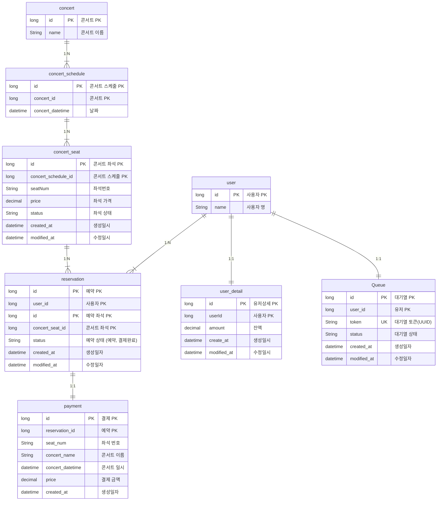

# 콘서트 예약 서비스

마일스톤

[Concert Reservation Service Milestone](https://github.com/users/wn1331/projects/2)

Sequence Diagram

[Sequence Diagram](docs%2FSequenceDiagram.md)

FlowChart

#### 콘서트 예약 서비스 메인 흐름도

비즈니스 로직 예상 및 분석

[대기열을 DB로 구현하는 경우에서 콘서트 예약 서비스의 비즈니스 로직 예상 및 분석](docs%2FBusinessLogic.md)

ERD

API 명세서

[콘서트 예약 서비스 API 명세서](docs%2FAPISPECS.md)

패키지 구조 및 기술 스택 선정

