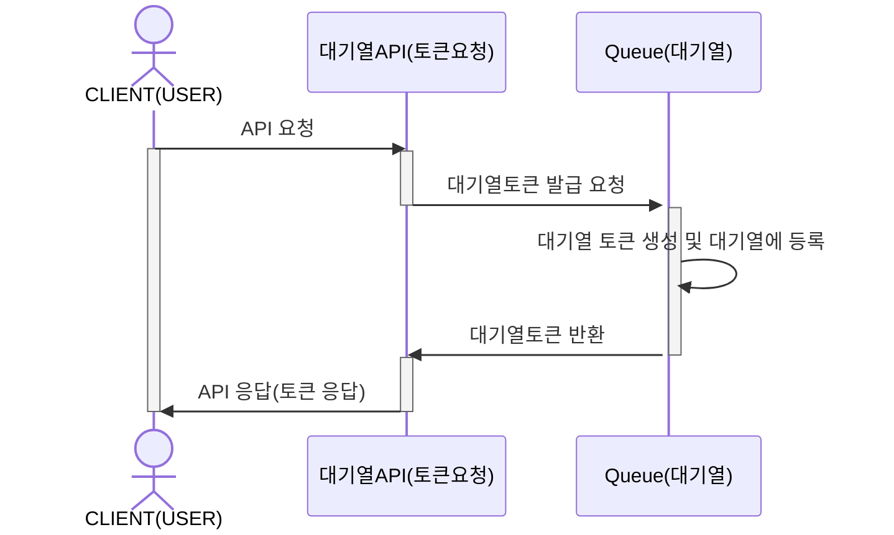
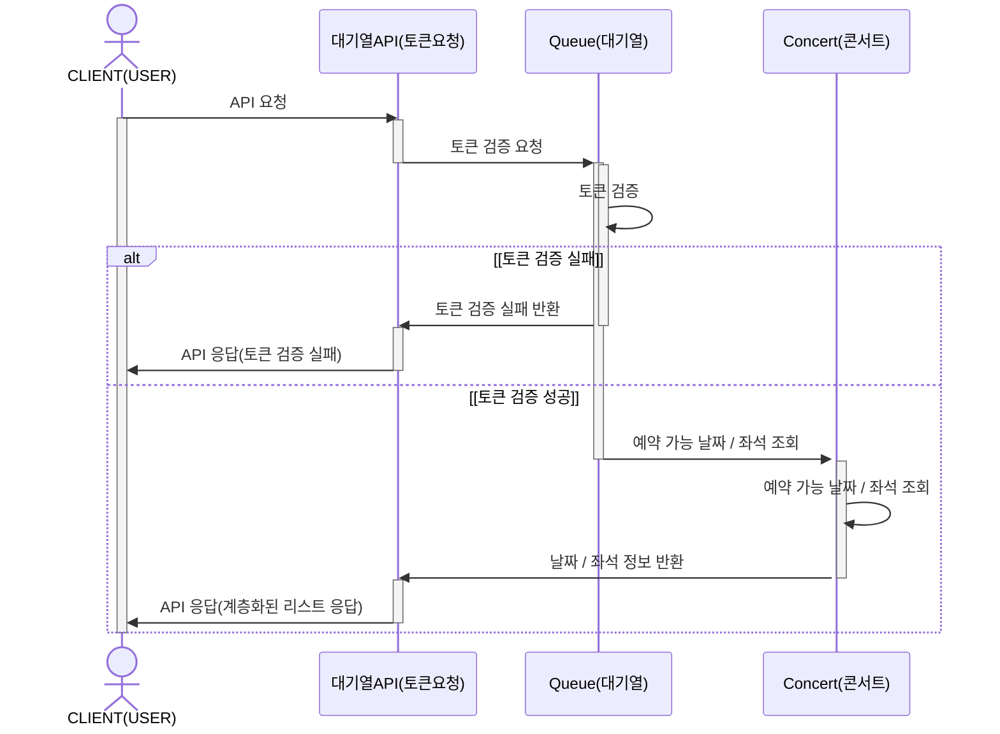
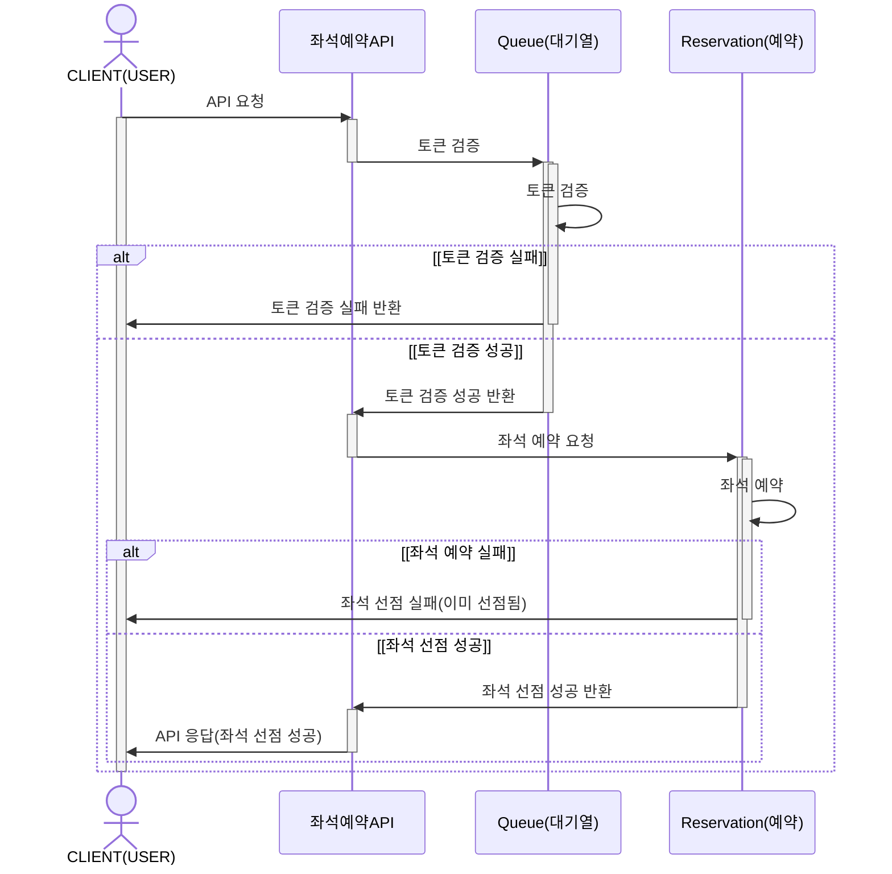
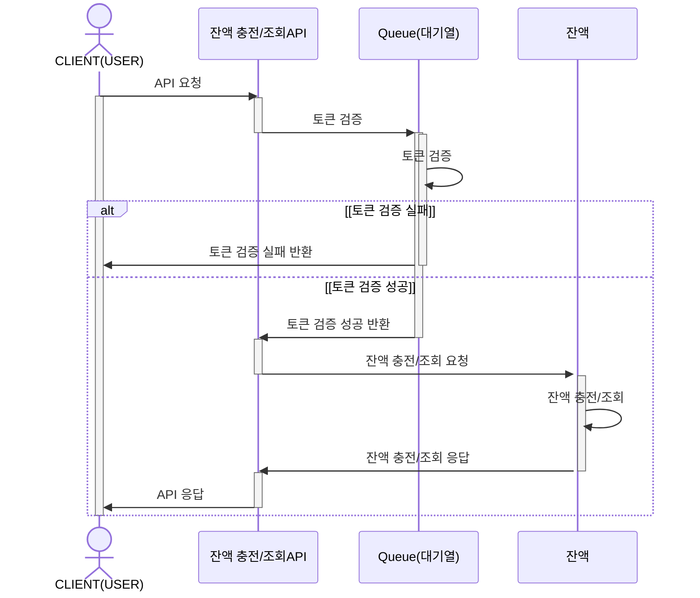
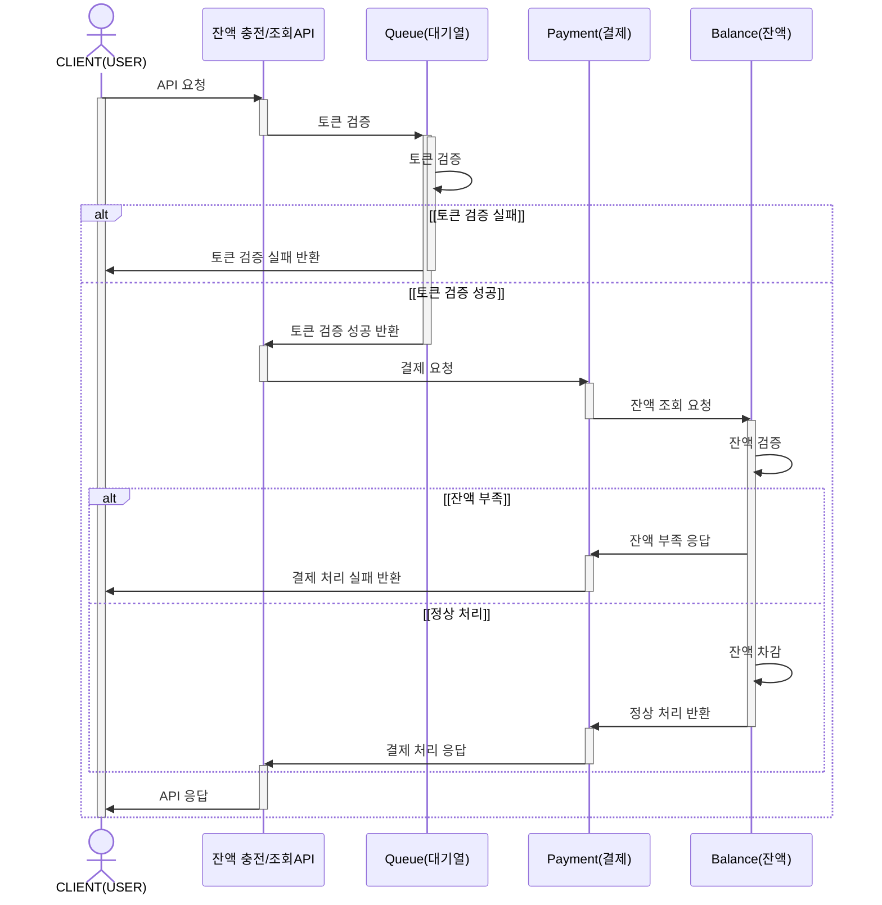
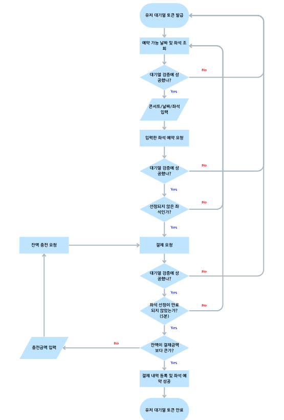

# 콘서트 예약 서비스

## 마일스톤

[Concert Reservation Service Milestone](https://github.com/users/wn1331/projects/2)

## 시퀀스 다이어그램

#### 유저 대기열 토큰 발급 API

#### 예약 가능 날짜 / 좌석 조회 API

#### 좌석 예약 요청 API

#### 잔액 충전 / 조회 API

#### 결제 API

## FlowChart
#### 콘서트 예약 서비스 메인 흐름도

