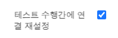
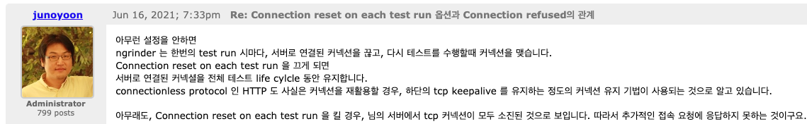

# 캐싱 분석 보고서

캐싱이란?

   
캐싱이란 **어플리케이션의 성능을 대폭 상승** 시켜주는 대표적인 기술이다.  
데이터를 일시적인 공간(캐시)에 저장하는 것을 의미하며, 조회 성능이 더 느린 계층(Disk I/O)에서 발생하는 `병목 현상`을 줄이기 위해 조회 성능이 더 빠른 계층에 임시로
데이터를 저장하는 방법이다.

캐시는 임시 파일과 임시 데이터들을 저장하는 메모리로, 더 빠르게 관련 데이터들에 접근을 할 수 있게 해준다.

그럼 어떤 정보를 저장해야 할까? 바로 **가장 많이 조회되는 데이터**
를 저장하면 된다.  
하지만 그렇게 단순하지는 않다. 가장 많이 조회되지만, 가장 변경이 많은 데이터를 캐시해버리면 오히려 성능 과부하가 일어날 수 있다.
이러한 성능 과부하는 `캐시 동기화` 때문에 일어나는데, 자세한 내용은 아래 콘서트 예약 서비스의 유스케이스들에서 간략하게 설명을 써 놓았다.

## 어떤 캐싱을 사용할 것인가

웹 어플리케이션에서의 캐싱은 크게 두 가지로 분류된다. 바로 `로컬 캐시`와 `글로벌 캐시`이다.

### 로컬 캐시란?

어플리케이션의 특정 인스턴스 내에서만 데이터를 저장하는 캐시이다. 즉, 같은 서버 프로세스 내에서만 접근 가능한 데이터 저장소이다.  
스프링에서 로컬 캐시를 사용한다면 하나의 프로세스에 저장. 즉, 같은 JVM을 사용하게 된다. (예외는 있다. EhCache의 경우 Disk에도 저장할 수 있다고 한다..)   
`JVM 메모리`에 저장되는 로컬캐시는 글로벌 캐시보다 `매우 빠른 속도`로 동작한다.  
하지만 여러 인스턴스에서 실행 중인 경우에는 각 인스턴스는 독립적으로 캐시데이터를 관리한다. 즉, 공유되지 않는다.  
따라서, 인스턴스가 여러개인 경우 `데이터의 일관성 문제`가 발생할 수 있다.

#### 로컬 캐시의 종류

1. `EhCache` : 자바에서 자주 사용되는 캐시 라이브러리로, 메모리 내에서 데이터 저장을 빠르게 처리한다.
2. `Caffeine` : 자바에서 사용하는 고성능 로컬 캐시 라이브러리이다. 일반적으로 사용하는 캐시 구현보다 뛰어난 성능과 기능을 제공한다.

### 글로벌 캐시란?

여러 어플리케이션 인스턴스나 서버 간에 **데이터를 공유하는 캐시**이다. 이 캐시는 로컬 캐시의 특징을 반대로 갖는다고
생각하면 편리하다.  
여러 서버 인스턴스가 동일한 캐시 저장소를 통해 `일관된 정보`를 사용한다.  
또한, 로컬 캐시의 동일한 데이터를 여러 번 저장하여 발생하는 `자원 낭비 역시 발생하지 않는다.`

하지만, 캐시 솔루션을 동작시킬 추가 컴퓨팅 자원(ex.Redis Server)을 구매해야 한다는 점은 부담으로 다가올 수 있다.  
그리고 캐시 서버와의 통신으로 인해 로컬 캐시보다 느린 성능을 보여준다.(당연한 것)  
마지막으로는 캐시 전략에 따라서 캐시 서버가 동작하지 않을 경우 서비스가 정상적으로 동작하지 않을 수도 있고, DB에 많은 요청이 몰리는 `Thundering Herd` 문제가
로컬
캐시보다 더 심각하게 발생할 수 있다는 단점이 있다.

#### 글로벌 캐시의 종류

1. `Redis` : 오픈소스 인메모리 DS 저장소로, 분산 환경에서 데이터 일관성 및 성능을 보장한다.
2. `Memcached` : 분산 메모리 캐시 시스템으로, 주로 DB부하를 줄이고 빠르게 데이터에 접근하는 데 사용된다.

| \  | 로컬 캐시                                      | 글로벌 캐시                                    |
|----|--------------------------------------------|-------------------------------------------|
| 장점 | 더욱 빠른 성능, 추가 컴퓨팅 자원 필요X                    | 인스턴스 간 일관된 캐시 정보 제공, 메모리 낭비 X             |
| 단점 | 인스턴스 간 다른 캐시 저장되면 일관성 깨짐, 데이터중복저장으로 메모리 낭비 | 서버와 캐시 솔루션간 통신으로 인한 성능 저하, 추가 서버 자원 구매 필요 |
| 종류 | EhCache,Caffeine                           | Redis,Memcached                           |

Thundering Herd

### Thundering Herd란?

글로벌 캐시, 즉 분산환경에서의 캐싱 동작에서 나타날 수 있는 문제로, 캐시가 등록되지 않은 상태에서 `동시에` 무수히 많은 N개의 요청이 들어왔다고 가정해 보자.  
N개 요청 전부 백엔드 DB에 데이터를 요청하며, N개의 요청이 원하는 값이 같다고 해도 N번의 요청이 그대로 진행된다.  
더불어 특별한 조치를 취하지 않으면, db에서 받은 데이터를 캐시에 N번 기록하는 작업도 진행된다. 이는 **DB와 캐시저장소 모두에
부하**를 일으키는 원인이 된다.   
이 문제를 `Thundering Herd` 문제라고 한다.

이 문제를 해결하는 방법에는 여러 가지가 있지만, `Cache Lock` 방법이 대표적이다.  
여러 요청 중 `최초의 요청만이 데이터베이스에 접근`하고, 결과를 캐시에 저장한다.  
이후의 요청들은 캐시에서 바로 데이터를 읽어오게 되므로, 데이터베이스에 대한 부하를 크게 줄일 수 있다.  
또한, `분산 락을 사용`함으로써 여러 서버 환경에서도 동일한 방식으로 Thundering Herd 문제를 방지할 수 있다.

캐시 디자인 패턴

## 캐시 디자인 패턴
캐시 디자인 패턴이란 `데이터의 효율적인 캐싱 및 관리`를 위해 설계된 방법론을 의미한다.  
각 패턴은 애플리케이션의 성능을 향상시키고 `데이터베이스 부하를 줄이기 위해 고안`되었으며, 특정 요구사항에 맞게 데이터 읽기 및 쓰기 시 캐시를 어떻게 활용할지를 정의한다.

캐시 디자인 패턴은 데이터의 일관성, 효율성, 처리 속도 등을 최적화하기 위해 다양한 전략을 제공하며, 패턴에 따라 캐시를 사용하는 방식이나 시점이 다르고, 데이터 읽기 성능을 높이기 위한 패턴과 쓰기 성능을 최적화하는 패턴으로 나뉜ㄴ다.
### Cache Aside Pattern (Lazy Loading)
애플리케이션이 데이터를 요청할 때 캐시에 데이터가 있는지 확인하고, 데이터가 없으면 저장소에서 가져와 캐시에 적재한다.  
`장점` : 캐시 미스가 치명적이지 않음, 캐시 히트율이 높아 리소스 효율적 사용, 기존 코드에 쉽게 적용 가능.   
`단점` : 이중 체크로 읽기 복잡성 증가, Warm-Up시간이 필요함, `Thundering Herd` 문제 발생 가능.

### Read-Through Pattern (Inline Cache)
`구조` : 캐시는 애플리케이션과 데이터베이스 사이에 위치하며, 데이터 적재 및 갱신은 비동기적으로 수행된다.   
`장점` : Cold Start 문제 해결 가능, 단순한 데이터 읽기 로직.   
`단점` : 배치 애플리케이션 관리 필요, 캐시 히트율 보장 어려움, 캐시 공간 부족 시 문제 발생.

### Write-Through Pattern
`구조` : 데이터를 캐시에 기록한 후 데이터 저장소에도 동기적으로 저장한다.   
`장점` : 최신 데이터를 유지 가능.   
`단점` : 쓰기 지연 발생, 리소스 낭비 위험.

### Write-Behind Pattern (Write-Back)
`구조`: 데이터를 캐시에 기록한 후 비동기적으로 데이터 저장소에 업데이트한다.  
`장점` : 네트워크 오버헤드 감소, 쓰기 성능 향상.  
`단점` : 구현 복잡, 데이터 손실 위험

### TTL (Time to Live) 패턴
캐싱된 데이터를 사용할 때에는 해당 캐시를 언제 만료할 것인가를 함께 고민해야 한다.   
TTL은 캐시 키(Key)가 `자연스럽게 만료`되어 없어지도록 하는 시간을 의미한다. 앞서 살펴본 캐시 패턴에 TTL(Time to Live)를 추가함으로써 다음과 같은 효과를 얻을 수 있다.   

`목적` : 캐시 데이터의 만료 시간을 설정해 `데이터 일관성을 유지`하고, `캐시 오염 방지`.   
`효과` : 
1. Read-Aside와 결합(정해진 시간이 지난 후 캐시 키가 삭제) 시 최신 데이터 유지.    
2. Write-Through(일정 시간 동안 업데이트 되지 않은 데이터는 자연스레 삭제)와 결합 시 리소스 낭비 방지.

### Refresh Ahead
캐시가 만료되기 전에 미리 주요 데이터를 갱신하는 전략이다.   
`장점` : 데이터 갱신 속도 개선.
`단점` : 잘못된 예측 시 성능 저하 발생.

---

## 모든 유스케이스에 대해 캐싱을 적용할 수 있는지 검토

#### 콘서트 스케줄조회

예약 가능한 스케줄 조회는 자정마다 변하는 데이터로, 캐시 만료 처리를 하기가 까다롭고, 정확한 캐시 만료를 설정하기 어렵다.   
만약 이 유스케이스에 캐시를 적용하고 싶다면, 세 가지 동기화 전략을 사용할 수 있을 것 같다.

1. 스케줄러에서 해당 캐시들을 일괄 삭제  
   이 방법은 `스케줄러에 지나치게 의존적`이게 되므로 적합하지 않다고 판단된다.
2. 해당 캐시에 ttl을 직접 설정  
   CacheManager에서 설정한 ttl은 어플리케이션 실행 시, 컨테이너에 빈을 등록하는 시점에 ttl이 설정된다. (자정까지의 남은시간을 ttl로 설정할 수 없음)  
   그래서 스케줄을 조회하여 직접 캐시에 담는 시점에 TTL을 설정(redisTemplate 사용)해주어야 하는데, 그렇게 되면 @Cacheable 어노테이션은 활용할 수
   없다. redisTemplate를 사용하여 캐시를 조회해야 한다.    
3. 스케줄 조회 캐시를 삭제하는 admin 전용 API를 만든다.
   자동화되지 않아, 좋은 방법이 아닌 것 같다.

#### 콘서트 좌석조회
좌석은 예약 시마다 변경되므로, 잦은 동기화,Evict 처리가 필요해 네트워크 I/O 부하가 증가한다.(`부적합`)

#### 콘서트 예약

예약 데이터를 메모리에 담을 경우 메모리 효율이 떨어진다.(`부적합`)

#### 유저 잔액조회

잔액 충전 및 결제 등으로 데이터 변경이 자주 일어나므로, 캐시 동기화 횟수가 많아, 네트워크 부하가 증가할 가능성이 크다.(`부적합`)

#### 대기열 생성

대기열은 매우 자주 변경되며, 좌석 조회보다 캐싱 효율이 떨어질 것으로 예상됨.(`부적합`)

#### **콘서트 조회** (`요구사항에 존재하지 않는 API`)

콘서트 예약 서비스에서 `가장 캐시에 적합`한 유스케이스이다. 데이터가 자주 변경되지 않으며, 조회 횟수가 가장 많은 유스케이스.   
요구사항에는 존재하지 않지만, 캐싱을 구현해 보고 싶어 콘서트 생성 API(admin 전용, Evict전략)도 같이
구현해서 성능 테스트를 해 보았다.

---

## 실제 서비스할때를 가정하고, 콘서트 조회(@Cacheable) API와 콘서트 생성(동기화, Evict전략) API를 구현

모든 콘서트 목록을 조회하는 서비스에는 아래와 같이 `@Cacheable` 어노테이션을 설정해 준다.

해당 콘서트가 바뀔 때마다 Evict처리(캐시 제거)를 해 주어야 한다.  
콘서트가 바뀌거나, 추가됐을 때 변경사항이 적용되지 않으면 문제가 있다.(`동기화 이슈`)   
데이터 일관성을 위해서 db의 내용과 캐시의 내용이 같아야 한다.
콘서트를 생성하는 서비스에서는 아래와 같이 `@CacheEvict` 어노테이션을 설정해 준다.

## 캐싱 전후 비교(부하테스트 +a)

`nGrinder` 부하 테스트 도구를 사용하여 `캐시를 적용하지 않은 콘서트 조회`와 `캐시를 적용한 콘서트 조회`를 비교해 보았다.
#### 서버 스펙
`CPU` : Apple Silicon M3 Pro `RAM` : 36GB
#### nGrinder 세팅
`성능 테스트 Vuser` : 400명
`프로세스 수` : 10개
`쓰레드 수` : 40개

엄청난 속도의 고양이(cpu 부하)

### 캐시 적용 X 콘서트 조회 부하테스트 결과

`TPS` : 1,175.6  `최대 TPS` : 2,006.0   
`평균 테스트 시간` : 278.34ms  `동작 시간` : 00:01:05   
`총 실행 테스트` : 42,398 `성공한 테스트` 42,398

### 캐시 적용 O 콘서트 조회 부하테스트 결과

`TPS` : 1,740.6  `최대 TPS` : 2,769.0   
`평균 테스트 시간` : 186.27ms  `동작 시간` : 00:01:01   
`총 실행 테스트` : 60,397 `성공한 테스트` 60,397

결과적으로 Redis를 활용하여 `캐시 적용 전후 부하 테스트` 결과는, **TPS가 약 1.48배 증가했고, 1.42배만큼의 테스트 수행횟수 증가**가 있었다.

### Node Exporter + Prometheus + Grafana를 사용하여 부하테스트를 모니터링 해보자.
#### 콘서트 조회 API 부하테스트 모니터링

캐시를 사용하지 않았을 때와, 캐시를 사용했을 때의 CPU 사용량과 메모리 사용량은 큰 차이가 없다.  
하지만, Memory Pages In/Out을 보면, 캐시를 사용했을 때의 pages_in 그래프가 솟아있지 않은 것을 볼 수 있다.  
  
`Pagesin이란?` : 디스크에서 메모리로 페이지가 이동되는 것을 의미   
`Pagesout이란?` : 메모리에서 디스크로 페이지가 이동되는 것을 의미   

아래는, 캐시를 사용했을 때의 Redis Dashboard는 hits수가 증가한 것을 볼 수 있다.
   

     
--------------------------------------------------   

  
   
# Redis를 이용한 로직 이관을 통해 성능 개선할 수 있는 로직 분석
가장 먼저 분석해보아야 할 것은, `왜 Redis를 사용해야 할까?`이다.  
Redis를 사용하는 가장 큰 이유는 바로 데이터 처리 속도와 효율성 때문이다. RDB를 사용하면 캐시되지 않았다고 가정할 경우에 데이터를 디스크에서 불러오지만, Redis는 항상 메모리에서 가져온다.  
대기열 시스템에서 많은 사용자 요청을 빠르게 처리하려면 응답 속도가 중요한데, Redis는 초당 수천-수만건의 요청을 처리할 수 있어, 대규모 트래픽을 효과적으로 관리할 수 있다.

### 성능 개선점 파악
현재 콘서트 예약 서비스의 대기열 시스템은 RDBMS 기반으로 구현되어 있다.    
이 시스템은 총 4가지 로직이 수행된다.    
`대기열 생성 요청` : 대기열 요청을 보내면 테이블에 대기열을 적재한다.  
`대기열 순번 조회(폴링)` : 해당 대기열의 순번을 조회한다.(PASS상태면 0번)  
`waiting 상태에서 5분이 지나면` : 스케줄러에 의해 대기열을 PASS 상태로 전환한다.  
`PASS 상태에서 5분이 지나면` : 스케줄러에 의해 대기열을 삭제한다.  

이 로직을 레디스로 이관하게 된다면 아래와 같이 개선할 수 있다.   
`대기열 생성 요청` : RDBMS가 아닌, NoSQL(Redis)의 waitqueue에 대기열을 Sorted-Sets구조로 적재한다.(zadd)     
`대기열 순번 조회(폴링)` : waitqueue에 존재한다면 순번 반환(zrank), activequeue에 존재한다면 순번 -1을 반환한다.   
`waitqueue에서 5분이 지나면` : 스케줄러에 의해 대기열을 activequeue로 이동시킨다.(waitqueue 삭제, activequeue 추가)   
`activequeue에서 5분이 지나면` : 스케줄러 없이, activequeue에 등록된 대기열들에 expire명령을 사용해서 자체적으로 만료가 되도록 설정한다.(대기열을 waitqueue에서 activequeue로 옮겨줄 때 expire명령 써서 만료시간 설정)   

위 개선된 로직에 쓰이는 Redis 자료구조는 Sorted-Sets와, Strings이다.  
### Sorted-Sets
랭킹 정보를 제공하는 데에 아주 적합한 Redis 자료구조이다. 
Sorted-Sets는 Score를 기준으로 정렬된 Unique String을 관리하는 컬렉션이다. 만약 Score값이 동일하다면, 사전순으로 정렬된다.  
대부분의 Sorted-Sets와 관련된 동작들은 O(log N)의 시간복잡도를 가진다.  

### Strings
일반적으로 사용되는 key-value의 형식을 가지는 자료구조이다.  
key와 value의 관계는 1:1이고, key는 중복될 수 없으며, 이미 존재하는 key를 하나 더 추가하려고 하는 경우 기존에 존재하던 value가 덮어씌워진다.  
문자열, 정수, 부동소수점, jpeg이미지 등 원하는 모든 데이터를 저장할 수 있으며, 전체 문자열에 대해 작업하거나 문자열의 일부에 대해 작업할 수 있으며ㅑ, 정수 및 부동 소수점 값을 증가 또는 감소시키는 작업도 가능하다.

### 기대 효과
`성능 개선` : Redis의 고속 데이터 처리 특성을 활용하여 대기열 등록 및 조회 속도를 대폭 향상시킨다.  
`부하 감소` : 데이터베이스 조회 및 삭제 작업이 줄어들어 RDBMS의 부하를 감소시킨다.  
`효율적인 만료 처리` : Redis의 expire 명령어를 통해 효율적인 만료 관리가 가능해진다. 스케줄러를 사용하지 않아도 되므로 시스템 리소스 사용을 최적화할 수 있다..!

## 대기열 이관 작업 후 부하테스트 및 Grafana 모니터링 비교

Redis로 대기열을 이관한 후, 기존 H2 기반의 대기열 요청 API에 대해 부하 테스트를 수행한 결과 Redis 대기열이 약 295 TPS 더 높은 성능을 보였다.  
(부하테스트를 하기 위해 대기열 요청 API와 대기열 순번조회(폴링용)을 분리했다.)
   
  
~~생각보다 H2의 성능이 좋다...?~~

이 수치는 드라마틱한 차이는 아니지만, 대기열 성능 최적화에서는 매우 유의미한 차이라고 생각한다.  
특히 H2 데이터베이스는 메모리 기반 테스트에 적합한 경량 DB로, 실제 운영 환경에서는 성능과 안정성 측면에서 한계가 있어 적합하지 않다.  
운영 환경에서의 `확장성이나 복잡한 쿼리 처리에서 제약이 매우 크기 때문`이다.  

그리하여 MySQL을 사용하여 대기열 요청 API에 대한 부하 테스트를 추가적으로 수행한 결과, Redis와 비교해도 성능 격차가 뚜렷하게 나타났다.  

MySQL에서는 대기열 요청의 TPS가 1257.6이 나타났으며, Redis는 이에 비해 무려 `3배정도의 성능`을 보여준다.  

### Grafana 모니터링

위 모니터링 그래프에서는 Redis와 H2는 CPU사용량과 메모리 사용량에서 차이가 거의 없는 것을 볼 수 있지만, Mysql에서는 나머지 두 그래프와는 다르게 메모리 사용량이 조금 더 적은 것을 볼 수 있다.  

-성능테스트 도중 레디스 Grafana 모니터링-

       

#### 성능테스트 시 오류 해결

nGrinder 사용 시 부하테스트가 자꾸 종료되는 문제

nGrinder를 처음 사용할 때, TPS가 엄청 안나오거나 테스트 도중에 10초간 커넥션 오류(Connection refused)가 나타나거나 하는 문제가 발생했었다.   
문제는 바로 Connection reset on each test run 옵션 때문이었다.

이 옵션을 끄니까 테스트가 정상적으로 동작했는데, nGrinder 관리자가 써놓은 답변은 아래와 같았다.

TCP KeepAlive 설정에 대해 찾아본 결과, 실제 프로덕션 환경에서는 TCP연결을 최대한 재사용하려고 하며, 특히 연결 빈도가 높은 시스템에서는 KeepAlive를 사용하여 연결을 유지하고, 필요 시 새로운 연결을 만든다고 한다.  
Http1.1에서는 기본적으로 Keep-ALive가 활성화되어 있어서 클라이언트-서버 간에 지속적인 연결이 가능하다고 한다.  

그래서 최대 TCP커넥션 수를 테스트하거나, 새 연결이 필요한 상황에서의 성능을 평가할 때만 `테스트 수행간에 연결 재설정` 옵션을 켜두는 것이 바람직하다고 한다.  

참고한 글 :
http://ngrinder.373.s1.nabble.com/Connection-reset-on-each-test-run-Connection-refused-td2703.html
https://velog.io/@more/23-09-06-TIL

  

#### 참고
로컬 캐시와 글로벌 캐시 : https://dev-qhyun.tistory.com/28  
Thundering Herd : https://techblog.lycorp.co.jp/ko/req-saver-for-thundering-herd-problem-in-cache  

