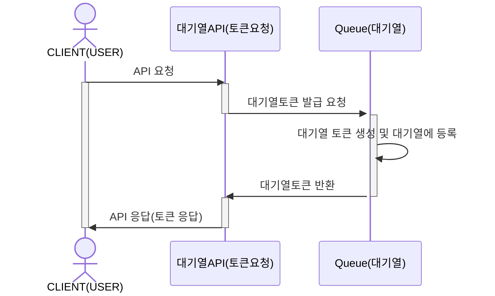
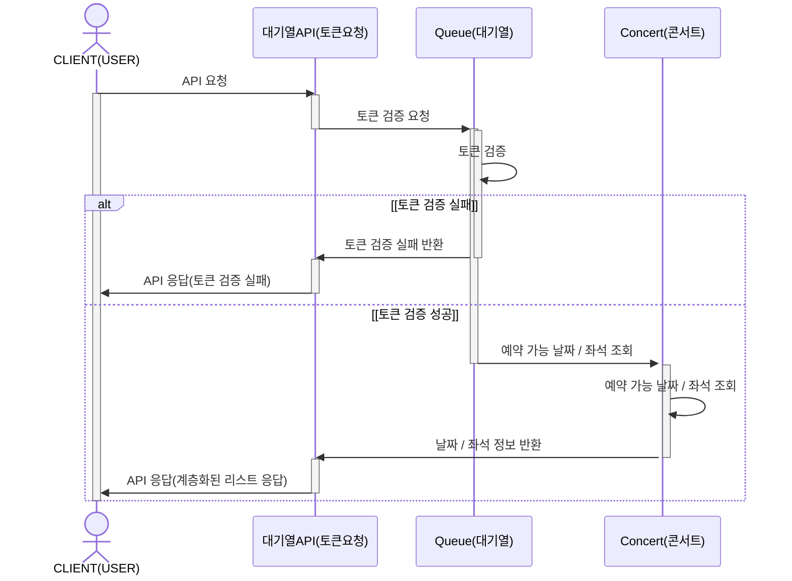
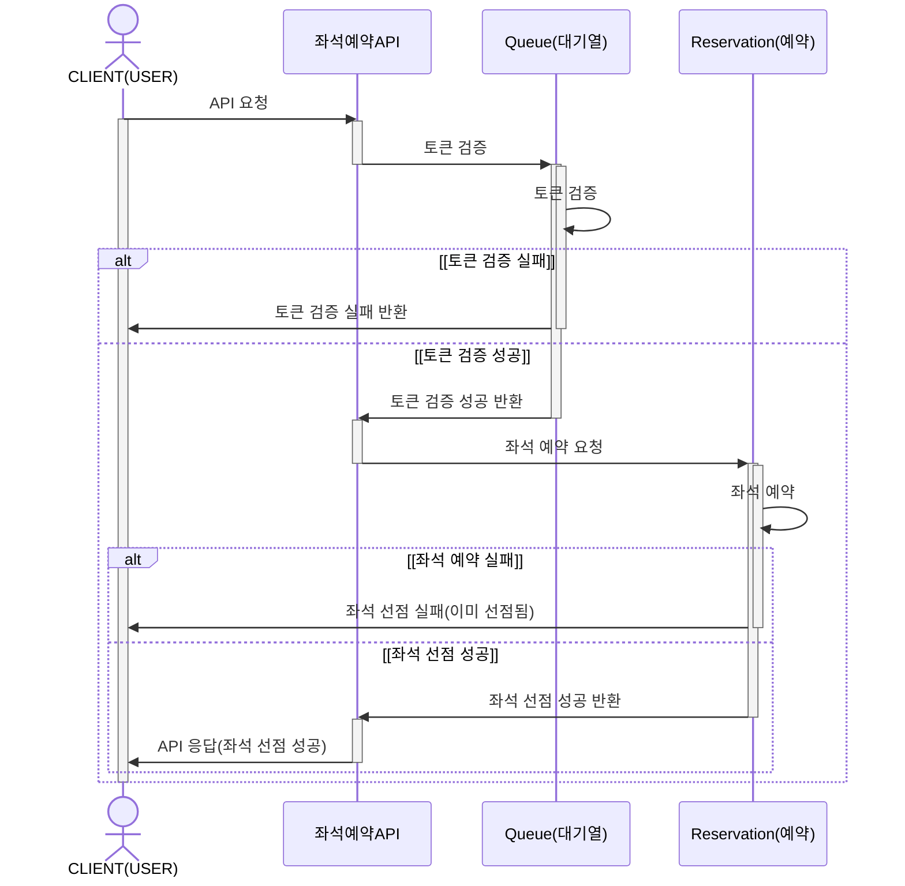
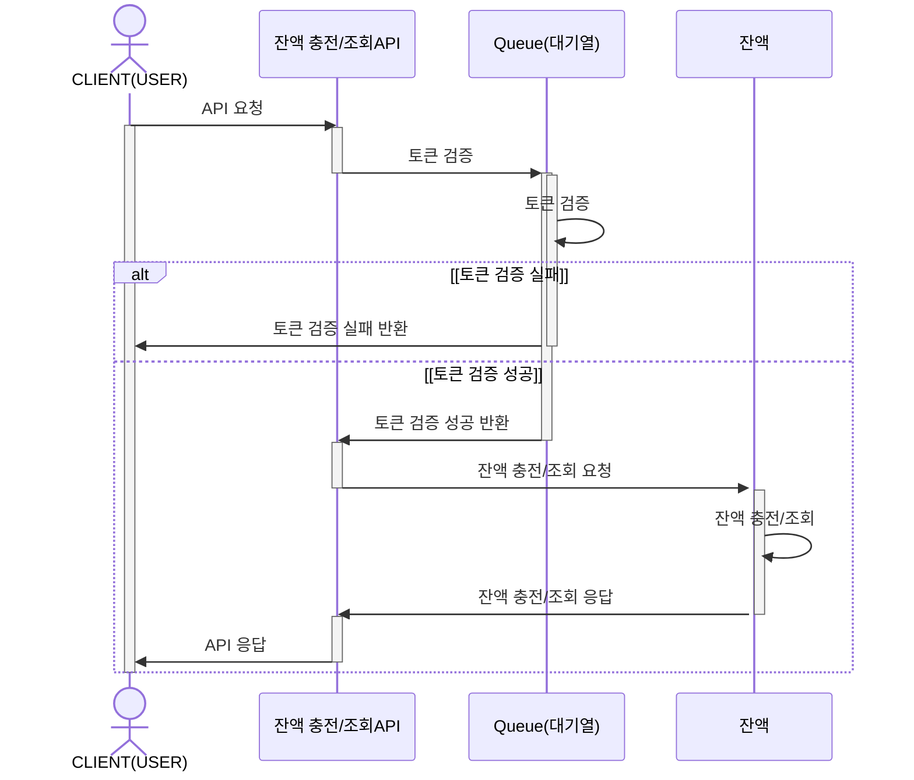
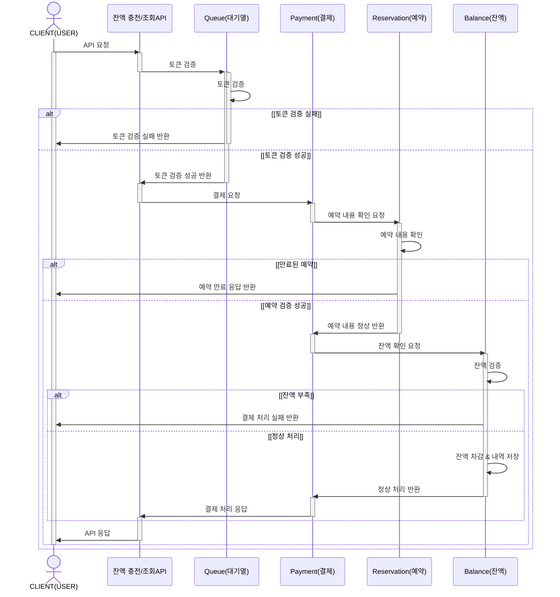
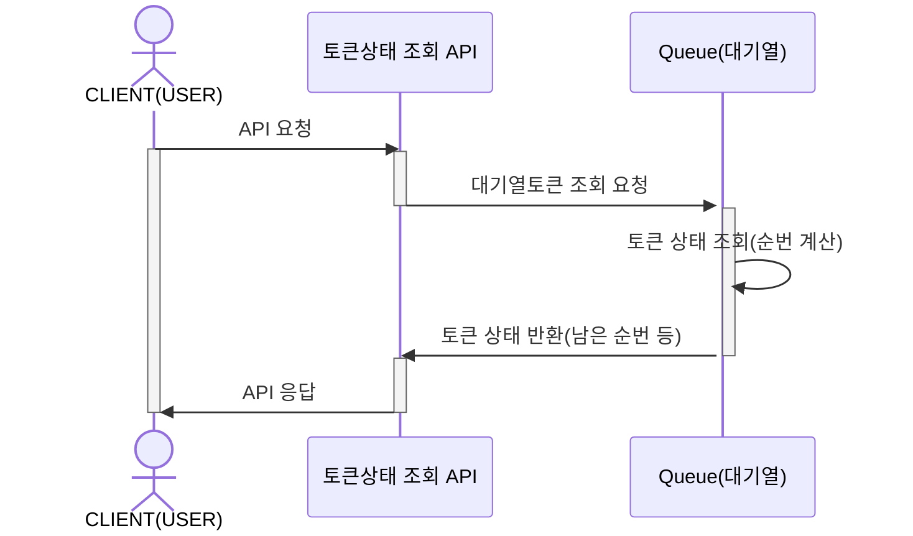

#### 유저 대기열 토큰 발급 API
유저가 대기열 토큰을 발급받음과 동시에 대기열 테이블에 해당 토큰을 등록해주는 API입니다.

클라이언트는 대기열 API에 토큰 발급을 요청합니다.  
대기열 API에서는, 대기열이 토큰을 발급하여 반환하고, 해당 토큰을 대기열에 등록되도록 시퀀스 다이어그램을 구성해 보았습니다.

#### 예약 가능 날짜 / 좌석 조회 API
특정 콘서트의 예약 가능한 날짜들을 조회하거나, 특정 콘서트의 예약 가능한 좌석들을 조회하는 API입니다.  
먼저, 클라이언트는 API에 조회 요청을 보냅니다.  
토큰의 status가 wait일 때와 success일 때를 구분하여, wait이라면, 토큰 검증에 실패하게 되는 것이고, success라면 토큰 검증에 성공하게 됩니다.  
토큰 검증에 성공하면, 단순히 예약 가능 날짜 또는 예약 가능 좌석을 조회하여 데이터를 반환합니다.  
날짜와 좌석 조회는 같은 흐름일 것이라 예상되어 한꺼번에 구성해 보았습니다.

#### 좌석 예약 요청 API

콘서트 예약 서비스의 첫 번째 핵심 API인 좌석 예약 요청 API입니다.  
클라이언트가 API 요청을 보내면 마찬가지로, 토큰 검증을 수행합니다.(wait/success)  
토큰 검증이 완료되면, 좌석 예약을 요청하는데, 좌석은 **공유 자원**이므로 동시성 이슈가 발생할 수 있습니다.  
그리하여, 좌석 예약에 실패하는 경우가 존재하는데, 이는 동시에 다른 유저가 먼저 좌석을 선점한 경우입니다.  
그렇게 된다면, 좌석 예약에 실패하고 바로 Exception이 발생하도록 해야 할 것이라 판단했습니다.  
좌석 예약에 성공했을 경우에는, 5분간 좌석을 선점하고 응답을 반환하도록 구성했습니다.

#### 잔액 충전 / 조회 API
유저의 잔액을 충전하거나, 조회하는 API입니다.  
클라이언트가 요청을 보내면, 대기열 토큰 검증을 수행합니다.(wait/success)  
토큰 검증에 성공할 경우, 잔액 충전/조회를 수행하고, 응답하도록 구성하였습니다.

#### 결제 API
콘서트 예약 서비스의 두번째 핵심 로직인 결제 API입니다.
클라이언트가 요청을 보내면, 토큰을 검증하고, 먼저 예약 사항을 조회합니다.  
예약이 만료됐다면, 클라이언트로 바로 실패 응답을 보냅니다.  
예약이 만료되지 않았다면, 잔액 확인을 요청하고, 잔액을 검증합니다.  
잔액 검증이 실패했다면(잔액부족), 클라이언트로 바로 결제 실패 응답을 보냅니다.  
잔액 검증이 성공했다면(정상처리), 잔액을 차감하고 내역을 저장 후 정상 처리된 응답을 반환하도록 구성하였습니다.

#### 토큰 상태 반환 API
유저가 대기열 토큰의 상태(남은 순번 등)를 조회하는 API입니다.  
클라이언트는 API에 토큰 발급을 요청합니다.  
이 API에서는, 대기열 토큰 조회를 요청하고,남은 순번을 계산한 후, 토큰 상태를 응답하도록 시퀀스 다이어그램을 구성해 보았습니다.

