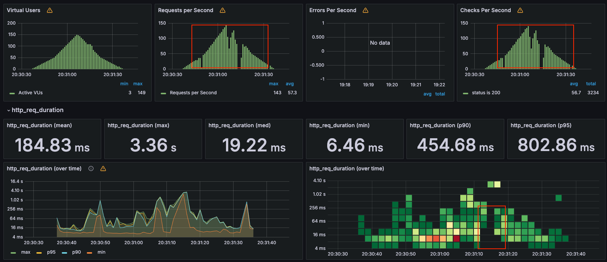

# 부하 테스트 보고서 

## 부하테스트 시나리오 선정 및 선정된 시나리오의 API 개별 테스트
(리스트)
1. 콘서트 조회 API (GET) /concerts
2. 대기열 생성 API (POST) /queues/enqueue
3. 대기열 조회 API (GET) /queues/order -> 계속 poll
4. 콘서트 스케줄 조회 API (GET) /concerts/{concertId}/schedules
5. 콘서트 좌석 조회 API (GET) /concerts/schedules/{scheduleId}/seats
6. 콘서트 예약 API (POST) /concerts/reservation
7. 콘서트 결제 API (POST) /concerts/reservations/{reservationId}/pay

위와 같은 API에서 부하

## 부하 테스트 환경 (Docker 리소스 동적할당.)
CPU : Docker Custom (2~6 core)  
RAM : 4~8GB  
**위 spec 범위가 변동되는 것은 Scale-up과는 다른 개념**

`실제 배포할 때를 예시로 들어, 테스트 환경을 매우 작게 두었다`

## API별로 부하 테스트 조건
부하 테스트 조건은 Docker로 스펙을 확 낮추었다는 점과, DB에 많은 양의 데이터가 존재한다는 점을 고려해서 Vuser를 최대 150으로 대폭 낮추었다.  
먼저, 몇 명의 Vuser일때부터 부하가 나타나는지 판단하기 위해 Vuser는 0부터 150까지 점진적으로 증가하도록 구성하였다. (로컬로 테스트했을 때는 vUser 6000까지 감당이 됐는데 도커로 스펙을 확 낮추니 150이 넘어가면 부하가 발생했다.)  
한 요청에 대해서 200ms이상 지연이 된다면(p99로 확인) 서버에 부하가 나타나는 것이라 판단하여 스크립트를 구성하였다.  
```javascript
export const options = {
  scenarios: {
    load_test: {
      executor: 'ramping-vus',
      startVUs: 0,                         
      stages: [
        { duration: '15s', target: 50 }, 
        { duration: '15s', target: 150 }, 
        { duration: '15s', target: 50 },  
        { duration: '15s', target: 0 },    
      ],
    },
  },
  thresholds: {
    'failed_requests': ['rate<0.02'],             
    'http_req_duration': ['avg<50', 'p(99)<200'], 
  },
  summaryTrendStats: ['avg', 'min', 'med', 'max', 'p(90)', 'p(95)', 'p(99)']
};
```
<br><br>

### 콘서트 조회 API(부하 X)


정상적으로 Request들을 처리해 나가다가, 150 Vuser가 유입될 때 까지 서버에 부하가 발생하지 않는는 것을 볼 수 있었다.(아슬아슬한 테스트 결과)  

Database에는 100개의 콘서트 정보들이 들어있으며, 현재 콘서트 조회 API는 캐싱 처리가 되어있다.   
첫 번째 요청 이후로는 캐시 메모리에서 데이터를 조회하므로 최적화 된 상태이다.  

현 상태에서 크게 성능 개선점을 찾는다면, `페이징 처리`를 함과 동시에 이에 대한 `캐싱 적용` 및  `복합인덱스`를 사용함으로서 큰 기대를 얻을 수 있을 것이라 판단된다.  
추가적으로, 로드밸런싱을 구현하여 스케일아웃 하는 방식도 고려해볼 수 있다.

### 대기열 생성 API(부하 O)


모든 요청이 성공했고, 실패한 요청은 없지만 p99를 보면 4초 가까이 지연이 발생한 것을 볼 수 있다.    
이렇게 부하가 발생한 이유는 다음과 같이 예상할 수 있다.(mysql은 type=const로 pk를 통한 인덱싱이 걸려있으며 빠른 속도로 조회 중)  

1. 서버 리소스 부족(가장 유력, 도커가 아닌 로컬로 테스트 시 vUser가 8000일때도 정상 동작)
2. 싱글쓰레드인 레디스의 insert에 의한 경합 발생

해결 방안은 어플리케이션 서버를 스케일아웃(로드밸런서를 통한 분산 어플리케이션)이나 스케일업 하는 방식을 고려해보거나 레디스를 클러스터링하는 정도라고 예상이 된다.

### 대기열 순번 조회 API(부하 X)


모든 요청이 성공했고, 실패한 사례도 없으며 p99도 적정하게 처리된 것 같다. 

### 콘서트 스케줄 조회 API(부하 O)


콘서트 스케줄은 1만건이 들어 있고(콘서트 100개, 콘서트 1개당 스케줄 100개), **복합 인덱스**가 걸려있다.  
```sql
CREATE INDEX idx_concert_id_concert_date ON CONCERT_SCHEDULE (concert_id, concert_date);
```
스크립트에서는 콘서트id를 랜덤한 값(1~100)으로 콘서트를 조회하도록 되어있다.  
부하가 나타난 이유는 아래와 같이 예상해볼 수 있다.  
1. 서버 리소스 부족(가장 유력) 
2. 레디스 부하

해결 방안은 `캐싱 처리`가 될 것 같다. 캐시 생성 시 자정까지의 초를 계산해 그 초가 지나면 캐시를 만료하는 전략으로 콘서트아이디 별로 캐싱처리하는 방식으로 구현해볼 수 있다.  
추가적으로 스케일아웃을 하거나 대기열 조회하는 로직에 부하를 덜기 위해 레디스 클러스터링 정도일 것 같다.  (그렇지만 캐싱으로 부하는 해결될 것이라 예상됨)


### 콘서트 좌석 조회 API(부하 O)


콘서트 좌석은 150만건이 들어있고(콘서트 스케줄 1개당 좌석 150개), **인덱스**가 걸려있다.
```sql
CREATE INDEX idx_concert_seat_schedule ON CONCERT_SEAT (CONCERT_SCHEDULE_ID);
```

스케줄id의 랜덤 범위는 현실적으로 20개로 지정했다. 유저가 좌석예약할 수 있는 콘서트의 날짜들은 상식적으로 1만개가 될 수 있을리 없기 때문...  
그럼에도 불구하고 p99에는 부하가 발생했다. 스케줄 조회에 비하면 심한 부하는 아니지만 부하가 발생한 이유는 마찬가지로 서버 리소스가 부족한 것이 주 원인이라 예상된다.
해결 방안으로는 캐싱처리를 하거나 스케일아웃을 하여 부하를 분산하는 것과 CPU/RAM 스펙을 올리는 스케일업 방식을 고려해볼 수 있을 것 같다.  
하지만 좌석조회에서의 캐싱처리는 오히려 레디스에 부하를 많이 줄 가능성이 높으므로(자주 갱신됨) 스케일링이 가장 좋은 방법이라 생각된다..

### 콘서트 예약 API


콘서트 예약에서도 마찬가지로 p99 부하가 발생했다. 좌석 조회 시의 인덱스가 활용되었지만 역시 캐싱처리가 되어있지 않은 API이다.  
또한 Redis pub/sub Lock으로 인한 레디스 부하가 심할 것이라 예상된다.  
마지막 1개 빼고 모든 요청이 성공했지만 한개의 실패 케이스의 경우에는 락 점유 때문이라고 판단된다.  
해결 방안으로는 Redis 성능 개선 또는 클러스터링, 어플리케이션 서버의 스케일링을 고려해 볼 수 있을 것 같다.  

### 콘서트 결제 API


콘서트 결제도 마찬가지로 부하가 나타났다.  
이는 외부 시스템(kafka)에 병목이 생겼다고 예상이 된다.
결제 API의 경우에도 인덱스와 캐싱처리가 되어있지 않다.  
요청이 많고, 트랜잭션 및 메시지 발행 작업이 높은 부하를 유발할 수 있다고 생각된다.  

해결 방안으로는 Kafka 성능 개선 및 어플리케이션 서버의 스케일링, 캐싱 및 인덱싱(아웃박스)이 있을 것 같다.

<br><br><br><br><br><br><br><br>
## 대기열 생성부터 결제까지의 시나리오 부하 테스트

시나리오의 흐름은 아래와 같다.
1. 대기열 생성
2. 대기열 순번을 조회하여 순번이 0이 될 때까지 반복 요청.(10초 간격으로 순번이 0이 될때까지 계속 폴링한다.)
3. 순번이 0이 되면 콘서트와 정보를 조회.
4. 콘서트 스케줄 조회
5. 콘서트 좌석 조회
6. 좌석 예약 요청.
7. 결제 요청, 완료 후 1초 대기

<details><summary>K6 Script</summary>

```javascript

import http from 'k6/http';
import { check, sleep } from 'k6';
import { Rate } from 'k6/metrics';
import { randomIntBetween } from 'https://jslib.k6.io/k6-utils/1.2.0/index.js';

const failRate = new Rate('failed_requests');

export const options = {
  scenarios: {
    load_test: {
      executor: 'ramping-vus',
      startVUs: 0,
      stages: [
        { duration: '30s', target: 50 },
        { duration: '30s', target: 150 },
        { duration: '30s', target: 50 },
        { duration: '30s', target: 0 },
      ],
    },
  },
  thresholds: {
    'failed_requests': ['rate<0.02'],
    'http_req_duration': ['avg<50', 'p(99)<200'],
  },
  summaryTrendStats: ['avg', 'min', 'med', 'max', 'p(90)', 'p(95)', 'p(99)'],
};

export default function () {
  const userId = randomIntBetween(1, 1000000);

  // Step 1: 대기열 생성
  const enqueueUrl = `http://host.docker.internal:8080/queues/enqueue`;
  const enqueueHeaders = { 'Content-Type': 'application/json' };
  const enqueuePayload = JSON.stringify({ userId: userId });

  let res1 = http.post(enqueueUrl, enqueuePayload, { headers: enqueueHeaders });
  check(res1, { 'status is 201': (r) => r.status === 201 });
  failRate.add(res1.status !== 201);

  const token = res1.headers['X-Access-Token']; // 대기열 생성 토큰
  if (!token) {
    console.error('Token not received');
    return;
  }

  // Step 2: 대기열 순번 조회
  let order;
  const orderHeaders = { 'X-Access-Token': token, 'Content-Type': 'application/json' };

  do {
    const orderUrl = `http://host.docker.internal:8080/queues/order`;
    let res2 = http.get(orderUrl, { headers: orderHeaders });
    check(res2, { 'status is 200': (r) => r.status === 200 });
    failRate.add(res2.status !== 200);

    const orderResponse = JSON.parse(res2.body);
    order = orderResponse.order; // JSON에서 'order' 값 추출
    sleep(10); // 10초 대기
  } while (order > 0); // 순번이 0이 될 때까지 반복

  // Step 3: 콘서트 조회
  const concertUrl = `http://host.docker.internal:8080/concerts`;
  let res3 = http.get(concertUrl, { headers: orderHeaders });
  check(res3, { 'status is 200': (r) => r.status === 200 });
  failRate.add(res3.status !== 200);

  const concertId = randomIntBetween(1, 100);

  // Step 4: 콘서트 스케줄 조회
  const scheduleUrl = `http://host.docker.internal:8080/concerts/${concertId}/schedules`;
  let res4 = http.get(scheduleUrl, { headers: orderHeaders });
  check(res4, { 'status is 200': (r) => r.status === 200 });
  failRate.add(res4.status !== 200);

  const scheduleId = randomIntBetween(1, 10000);

  // Step 5: 콘서트 좌석 조회
  const seatsUrl = `http://host.docker.internal:8080/concerts/schedules/${scheduleId}/seats`;
  let res5 = http.get(seatsUrl, { headers: orderHeaders });
  check(res5, { 'status is 200': (r) => r.status === 200 });
  failRate.add(res5.status !== 200);

  const concertSeatId = randomIntBetween(1, 1500000);

  // Step 6: 좌석 예약
  const reservationUrl = `http://host.docker.internal:8080/concerts/reservation`;
  const reservationPayload = JSON.stringify({
    userId: userId,
    concertSeatId: concertSeatId,
  });

  let res6 = http.post(reservationUrl, reservationPayload, { headers: orderHeaders });
  check(res6, { 'status is 200': (r) => r.status === 200 });
  failRate.add(res6.status !== 200);

  const reservationId = JSON.parse(res6.body).reservationId; // 예약 ID 추출
  if (!reservationId) {
    console.error('Reservation ID not received');
    return;
  }

  // Step 7: 결제
  const paymentUrl = `http://host.docker.internal:8080/concerts/reservations/${reservationId}/pay`;
  const paymentPayload = JSON.stringify({ userId: userId });

  let res7 = http.post(paymentUrl, paymentPayload, { headers: orderHeaders });
  check(res7, { 'status is 200': (r) => r.status === 200 });
  failRate.add(res7.status !== 200);

  sleep(1);
}


```

</details>


대기열 생성부터 결제까지 시나리오를 작성하고, 부하테스트를 돌려보았다.  

이번 시나리오 부하 테스트에서 성공률은 100%로, 2071번의 요청 및 172번 수행된 시나리오들은 전부 정상적으로 동작하였다.


하지만 응답 시간에서 병목 현상을 발견할 수 있었다.  
응답 시간(p99 = 2.77초, p95=1.93초)에서 많은 부하가 발생한다는 것을 확인하였고 Redis(대기열+분산락), Kafka(+outbox)의 경합, 서버 리소스 부족이 주요 원인으로 분석되었다.  
스케일아웃 또는 스케일업 그리고 캐싱 최적화를 통해 성능을 개선할 수 있을 것 같다고 판단된다.  
이 시나리오 테스트는 많이 제한적인 리소스 환경에서 수행되었으므로, 실제 운영 환경에서 추가 테스트가 필요할 것이라 판단된다.  

향후 작업 계획으로는 Redis 클러스터링 및 kafka 최적화 적용이 있어야 할 것이고, 캐싱 또는 DB인덱스 최적화하여 성능 개선을 꼼꼼히 체크해야 한다.

